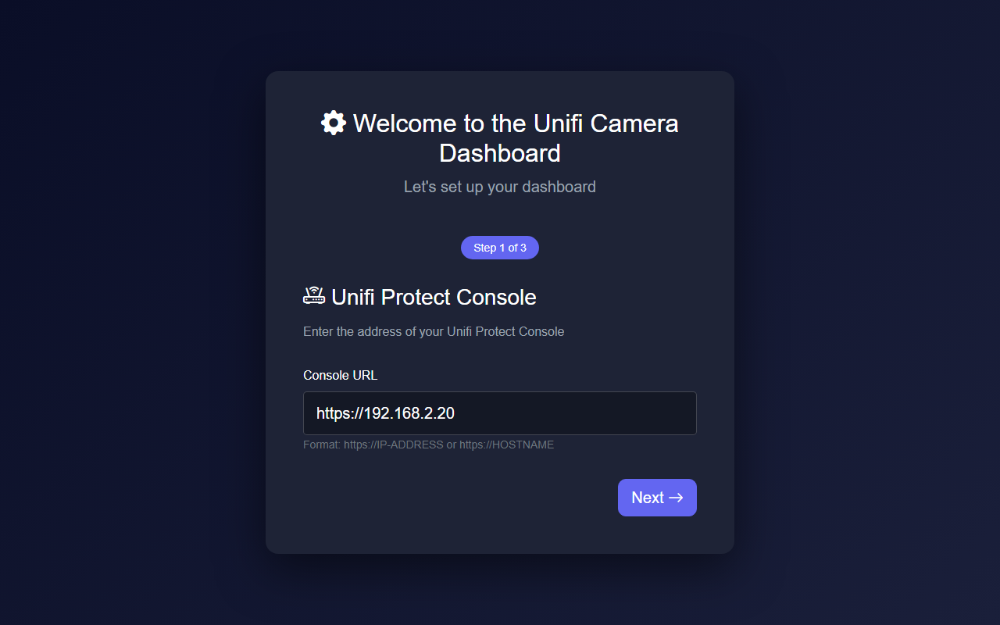

# UniFi Camera Dashboard

[](https://github.com/lukislp/UnifiProtectDashboard/actions/workflows/ci-cd.yml)
[](https://github.com/lukislp/UnifiProtectDashboard/releases)
[](LICENSE)
[](https://dotnet.microsoft.com/)

A self-hosted Blazor Server dashboard for [UniFi Protect](https://ui.com/camera-security) cameras. Displays live snapshots and HLS streams for all discovered cameras, with automatic session management and a setup wizard on first run.



## Features

- **Snapshot mode** — auto-refreshing JPEG previews proxied through the server (the browser never touches the UniFi Protect API directly)
- **HLS live streaming** — low-latency H.264 streams via FFmpeg + hls.js
- **Camera discovery** — scans the UniFi Protect console and persists cameras to a local SQLite database
- **Setup wizard** — guided first-run configuration (console URL, credentials)
- **i18n** — UI language follows the browser locale; English and German included; add more by dropping a JSON file into `i18n/`
- **Docker-first** — single `docker compose up -d` to run; data persisted in a named volume

## Tech Stack

| Layer | Technology |
|---|---|
| Framework | .NET 10, Blazor Server (InteractiveServer render mode) |
| Database | SQLite via EF Core (`EnsureCreatedAsync` — no migrations) |
| Video | FFmpeg + hls.js |
| Auth | UniFi Protect cookie + Bearer token session, shared across all scoped service instances via static state |
| i18n | Singleton `TranslationStore` (JSON files) + scoped `I18nService` per circuit |

## Project Structure

```
UnifiCameraDashboard/
  Components/
    Pages/
      Home.razor              # camera grid, snapshot / HLS toggle
      Discovery.razor         # discover and persist cameras
      Settings.razor          # connection settings
      Setup.razor             # first-run wizard
      Error.razor
    Layout/
      MainLayout.razor
      NavMenu.razor
    Shared/
      LanguageProvider.razor  # JS interop: reads navigator.language post-connect
    LocalizedComponentBase.cs   # abstract base: subscribes to OnLanguageChanged, calls StateHasChanged
    LocalizedSetupCheckBase.cs  # LocalizedComponentBase + setup redirect check
    SetupCheckBase.cs
  Controllers/
    SnapshotController.cs       # GET /api/snapshot/{cameraId} -- auth proxy
    HlsController.cs            # GET /api/hls/start/{cameraId}
    StreamController.cs         # GET /api/stream/mjpeg/{cameraId}
    CamerasController.cs        # GET /api/cameras
    DiscoveryController.cs      # POST /api/discovery/start
    PingController.cs           # GET /api/ping, /api/health
  Services/
    UnifiProtectService.cs      # UniFi Protect API client (auth, snapshots, bootstrap)
    UnifiCameraService.cs       # camera CRUD + discovery orchestration
    CameraRepository.cs         # EF Core repository
    FfmpegService.cs            # HLS segment generation
    SettingsService.cs          # persisted settings (URL, credentials)
    TranslationStore.cs         # singleton: loads i18n/*.json at startup
    I18nService.cs              # scoped: holds language state, exposes Get(key)
  BackgroundServices/
    CameraAutoDiscoveryService.cs
  Models/
    UnifiCamera.cs
    UnifiProtectModels.cs
    CameraSettings.cs
  i18n/
    en.json
    de.json
  Dockerfile
  wwwroot/
```

## Running Locally

Requires the [.NET 10 SDK](https://dotnet.microsoft.com/download) and `ffmpeg` on `PATH`.

```bash
git clone https://github.com/lukislp/UnifiProtectDashboard.git
cd UnifiProtectDashboard/UnifiCameraDashboard
dotnet run
```

Open `https://localhost:7150` — the setup wizard runs automatically on first start.

The SQLite database is created at startup. Override the data directory:

```bash
DATA_DIR=/tmp/mycameras dotnet run
```

## Docker

```bash
docker compose up -d
```

The container listens on port `5003`. All data is persisted in a named volume at `/data`. FFmpeg is installed automatically inside the container image — no manual download needed.

```yaml
# docker-compose.yml
services:
  unifidashboard:
    build:
      context: ./UnifiCameraDashboard
      dockerfile: Dockerfile
    container_name: unifidashboard
    ports:
      - "5003:5003"
    volumes:
      - unifidashboard_data:/data
    environment:
      - ASPNETCORE_ENVIRONMENT=Production
      - DATA_DIR=/data
    restart: unless-stopped

volumes:
  unifidashboard_data:
```

Build the image manually:

```bash
docker build -t unifidashboard ./UnifiCameraDashboard
```

## Adding a Language

Drop a new file into `i18n/`:

```json
// i18n/fr.json
{
  "Dashboard": "Tableau de bord",
  "Settings": "Paramètres"
}
```

`TranslationStore` picks it up on the next application start. Keys missing from the new file fall back to English.

## API Endpoints

| Method | Path | Description |
|---|---|---|
| `GET` | `/api/snapshot/{cameraId}` | Auth-proxied JPEG snapshot |
| `GET` | `/api/hls/start/{cameraId}` | Start HLS stream, returns playlist URL |
| `GET` | `/api/stream/mjpeg/{cameraId}` | MJPEG stream (multipart) |
| `GET` | `/api/cameras` | All persisted cameras (JSON) |
| `POST` | `/api/discovery/start` | Trigger camera discovery |
| `GET` | `/api/ping` | Health check |

## Troubleshooting

**Snapshots return 503** — the server-side UniFi Protect session expired. The service re-authenticates automatically on the next request. If it persists, verify credentials in Settings.

**HLS stream not starting** — verify `ffmpeg` is installed inside the container (`docker exec unifidashboard ffmpeg -version`). The Dockerfile installs it via `apt`.

**Language not switching** — `LanguageProvider` runs JS interop after the SignalR circuit connects, so there is a brief SSR-phase render in the Accept-Language before the browser locale is applied. Both paths fall back to `en` if no matching translation file exists.

**Database error on startup** — the process needs write access to the directory pointed to by `DATA_DIR`.

## Disclaimer

This is an unofficial project and is not affiliated with or endorsed by Ubiquiti Networks.
